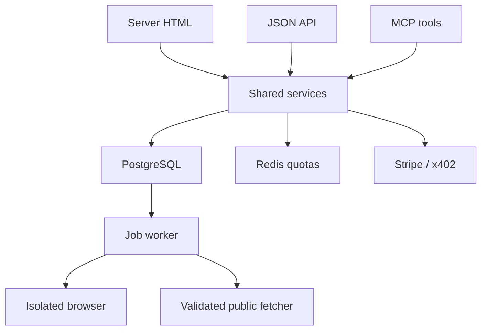

# Full launch architecture

## Product decision

Lead with two independent measurements: **Can agents use this website?** and **Can this agent complete these browser tasks?** The shared identity, evidence history and versioned comparisons form the useful dataset. Neither a novel-feature claim nor market exclusivity has been verified; do not market the scanner as “the only one”.

The homepage opens with the scanner. The benchmark is the second primary route. The other utilities support repeat developer use rather than diluting the positioning.

## Stack and topology

| Layer | Choice | Reason |
|---|---|---|
| Public service | Python 3.12, FastAPI, Jinja | Real server HTML, typed API and PDF ecosystem |
| MCP | Official Python SDK, Streamable HTTP | Protocol negotiation and discovery; no homemade JSON-RPC facade |
| Database | PostgreSQL 17 | Ownership, transactional jobs, audit records, immutable results |
| Quotas | Redis atomic counters | Shared API-key and anonymous request limits |
| Scanner | aiohttp with resolving connector | Validate every DNS result, pin destination at connection time |
| Browser measurements | Separate Playwright/Chromium container | Browser version, viewport, CLS and raw/rendered evidence |
| Background processing | PostgreSQL job claims using SKIP LOCKED | Durable queued scans without a second job store |
| PDF extraction | pypdf in a memory/CPU-bounded subprocess | Text PDFs, no external upload provider |
| Payments | Official x402 SDK and Stripe SDK | Protocol payments and verified subscription events |
| Hosting | Docker Compose initially; isolated workers under gVisor/Kata for public production | Containers are required; the static Sites runtime cannot host this stack |
| Edge | HTTPS reverse proxy/WAF | Body limits, abuse limits, trusted client IP handling |
| SDKs | Thin Python and JavaScript clients | The same API, no duplicated business logic |

All three interfaces call the same service functions. Reports and source snapshots are persisted once, then rendered or serialized. No client JavaScript is necessary to read a table, result, status or document. Native forms support humans. Each HTML page includes JSON-LD. `/openapi.json` is generated from the actual API, and `docs/openapi.json` is a build snapshot. `/mcp` is provided by the official SDK. `agent.json` is explicitly a project-specific manifest, not a falsely claimed universal standard.

## Readiness Scanner

Flow: validate URL → enforce quota → persist job → verify robots permission → fetch bounded HTML with DNS pinning → probe discovery documents → request isolated browser measurement → calculate versioned checks → persist report → render HTML/JSON/MCP → permit badge only on a public, complete report.

| Check | Weight | Evidence |
|---|---:|---|
| Semantics | 20 | Main landmark, h1, native controls, table headers |
| Input labels | 15 | Non-empty explicit, nested or ARIA labels |
| Layout stability | 15 | CLS session window during five seconds at 1365×768 |
| CAPTCHA indicators | 10 | Known markup/provider patterns; absence is not proof |
| llms.txt | 5 | Useful non-HTML text document |
| Robots policy | 10 | URL-specific permissions for named agents; a policy choice |
| Initial HTML | 15 | Raw/rendered visible-text ratio |
| API discovery | 10 | Parsed OpenAPI document or capabilities manifest |

Unknown evidence is never silently awarded points. An incomplete scan has `score: null`, measured coverage and a possible range. A complete report has a 0–100 score. Raw/rendered text ratio is a heuristic, not proof of full interaction accessibility. Tables, forms and task success need deeper manual or browser-task evaluation. Failed HTTP targets do not receive a score. The browser does not log in, solve CAPTCHAs or run a model over untrusted page instructions.

The public report is opt-in. Query strings are rejected to avoid retaining URLs containing secrets. Only public HTTP(S) targets on standard ports are accepted. Redirect destinations and all DNS answers are checked. Browser requests are mediated by the safe fetcher; sockets, service workers and non-GET browser requests are blocked. Production still needs kernel/container isolation and network enforcement; application URL checks are not a sandbox against browser exploits.

## Benchmark trust model

Publish the suite version, seed, challenge description and scoring method. A result includes the suite hash, agent-declared version, per-challenge outcomes and an Ed25519 signature. The signing key stays server-side; publish only the public key and key ID. Keep old public keys during rotation.

The current answer-scoring implementation is a **community track**. Because callers can submit answers through API/MCP, it does not prove UI execution or vendor identity. It must not be ranked as independent evidence. The production verified track needs a trusted harness that records actual browser actions, elapsed time, environment image digest, screenshots/traces and agent adapter configuration. Run five or more deterministic seeds per version and report mean, spread, completion rate, latency and cost separately. Never rank different suite versions together. Signing authenticates a result; it does not eliminate statistical variation.

The initial seven challenges cover nested controls, matrices, staged form fields, revisioned state, iframe reading, dates and uploads. True changing-state and enforced multistep progression need the stronger harness tracked in LAUNCH_STATUS. Monthly releases must be reviewed, versioned and immutable, with a holdout set to reduce overfitting. Do not silently change an old suite or automatically fabricate “new” challenges each month.

## Useful launch data niche

Environment Agency flood warnings are a narrow, official public feed. Each row carries its original source URL, OGL licence link and source update time. Fetch time is separate. Cache the source and poll every 15 minutes; expose stale state after 30 minutes. Failure preserves the last snapshot with stale status and never fills the gap with made-up values. This is not an emergency-warning service. Check source documentation and operational guidance before production.

## Draft claims

Scope the first release to single direct-flight arrival delays. Ask for regime, departure/arrival jurisdictions, carrier jurisdiction, actual final-arrival delay, distance and extraordinary circumstances. Calculate a potential band only when the supplied facts meet the supported conditions. Unknown eligibility generates an inquiry letter, not an asserted entitlement. Include operator contact, passenger details, flight details, facts and requested response. No submissions, stored letters, cancelled-flight calculations or legal conclusions beyond the supported rule table.

## Availability changes

Subscriptions support signed HTTPS webhooks and MCP polling. Events have stable IDs, timestamps and at-least-once delivery; consumers deduplicate. Secrets are encrypted at rest and disclosed once. Failures retry with exponential backoff, then stop. Only reviewed source adapters are enabled; the initial adapter covers the open-data feed. This is not yet a retailer restock service. Before adding one, record source permission/licence, acceptable polling interval, semantics and terms review. Do not infer stock from a CAPTCHA or purchase anything.

## Formatter

TXT, HTML, JSON, Markdown and text-based PDFs. Bound input bytes, PDF pages, CPU, memory and output characters. Reject encrypted or image-only PDFs clearly. Temporary framework upload handles are closed; production uses tmpfs, and extraction runs in memory. No uploaded content is persisted or logged. Return JSON, plain Markdown or `.llms` text. Token counts are deliberately approximate UTF-8 heuristics, not invented exact provider counts. Model-specific provider count APIs can be added with consent because they send content externally.

## Payments and monetisation

Free needs no signup. Keys are optional for durable subscriptions and required for paid accounts. Stripe creates hosted Checkout sessions; verified, deduplicated webhook events update entitlements using the latest subscription state. A success redirect does not grant access.

x402 routes use the official v2 middleware, HTTP 402, PAYMENT-REQUIRED/PAYMENT-SIGNATURE headers and an EVM exact-payment scheme. Testnet is the default configuration; no wallet or mainnet facilitator is invented. Configure Base mainnet/USDC only after settlement and replay tests. Premium scans and bulk scans have bounded costs. Transaction settlement/job atomicity and receipt-bound idempotency require launch hardening; no mainnet payment is enabled by default.

Paid private hosted benchmark execution requires a real harness and queue; merely labelling a request “priority” adds no value. Certification requires verified domain control, paid entitlement, complete evidence, a threshold policy, expiry, monthly rescans and revocation. The current code contains the persistence contract and a clearly unavailable public description, not a fake certified badge.

Sponsored directory records explicitly include `sponsored: true`, and HTML labels/link attributes identify paid placement. Sponsorship never enters scoring. No ad scripts are injected into tool payloads or reports. Human sponsor slots can be added on the landing page, without third-party tracking by default.

## Retention and trust

Private scans expire after 30 days; public reports are retained until removal; abuse reports expire after 90 days. No upload/letter retention. Complete policies must identify the real controller, processors, hosting location, transfers, legal bases and billing retention before public launch. Essential-only cookie notice does not require an advertising popup. Future non-essential tracking requires a valid consent mechanism.
